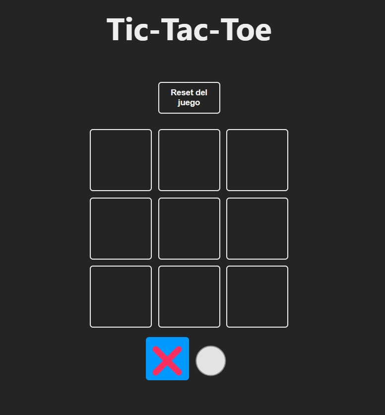
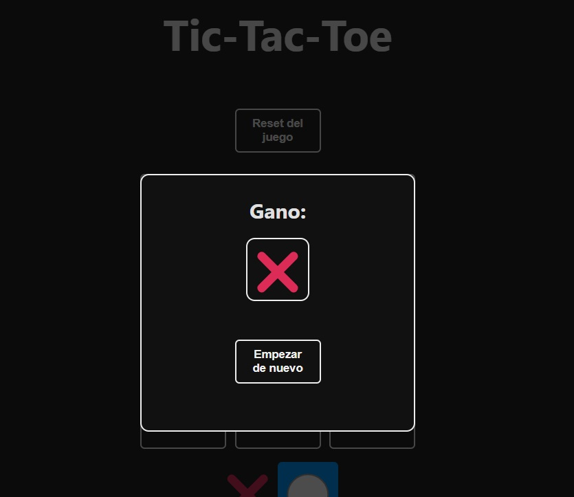

# Tic-Tac-Toe Game in React

Este proyecto es un juego de **Tres en Raya (Tic-Tac-Toe)** implementado en **React** utilizando los hooks de estado como `useState`. El objetivo es ser el primero en alinear tres símbolos (X u O) en una cuadrícula de 3x3.

## Tabla de Contenidos
- [Descripción](#descripción)
- [Características](#características)
- [Cómo Jugar](#cómo-jugar)
- [Uso de Hooks](#uso-de-hooks)

## Descripción

Este proyecto está diseñado para demostrar cómo construir un juego interactivo usando **React**. El juego guarda el estado del tablero, gestiona los turnos y detecta al ganador. También utiliza el **localStorage** del navegador para mantener el estado del juego entre recargas de la página.

## Características
- Juego clásico de Tres en Raya.
- Gestión del estado del tablero y de los turnos con React hooks (`useState`).
- Reseteo de la partida con un botón.
- Persistencia del juego usando `localStorage` para mantener los datos incluso si la página se recarga.
- Detección automática de ganador o empate.

## Cómo Jugar

- Haz clic en una de las casillas vacías para colocar tu símbolo (X o O).
- Los turnos alternan entre los jugadores.
- El juego detectará automáticamente si un jugador ha ganado o si la partida ha terminado en empate.
- Usa el botón de "Reset" para comenzar una nueva partida.

## Uso de Hooks

El juego utiliza el hook `useState` para gestionar el estado del tablero, el turno actual y el ganador. A continuación, se describe cómo se manejan estos estados:

